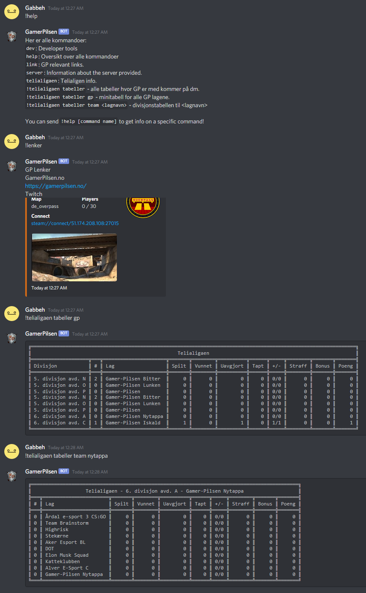

# Gamer-Pilsen Discord Bot

For [GamerPilsen](https://gamerpilsen.no) by [Gabbeh](https://gabbeh.no)

Grade

[![CodeFactor][codefactor badge]][codefactor]
[![Language grade JavaScript][lgtm grade javascript badge]][lgtm grade javascript]
[![Codacy Badge][codacy badge]][codacy]
[![Maintainability][codeclimate maintainability badge]][codeclimate maintainability]
[![Code Inspector Grade][codeinspector grade badge]][codeinspector grade]

Score

[![Code Inspector Score][codeinspector score badge]][codeinspector score]

Coverage

[![codecov][codecov badge]][codecov]
[![Coverage Status][coveralls badge]][coveralls]
[![Test Coverage][codeclimate coverage badge]][codeclimate coverage]

Issues

[![DeepSource][deepsource badge]][deepsource]
[![Total alerts][lgtm total alerts badge]][lgtm total alerts]

## Overview

- Check [Telialigaen](https://telialigaen.no) stats.
- Check CS:GO Community Server status.

## How it looks

## Run

Start in developer mode: `node --inspect ./index.js`

You can use nodeman with watcher for instant reload `nodemon --inspect --watch`

## Todo:

guild admin commands for telialigaen api.
set which seasons we are interested in.
maybe search for all seasons and not just active.
maybe several games.

## Made with

- [Discord.js](https://discord.js.org) bot framework
- https://github.com/vgalisson/csgo-map-icons - CS:GO Map Icons
- https://github.com/akisman/js-ascii-table - JS Ascii Table

<!-- Links -->

[codefactor]: 3https://www.codefactor.io/repository/github/hvgab/gamer-pilsen-discord-bot
[codecov]: https://codecov.io/gh/hvgab/Gamer-Pilsen-Discord-Bot
[codacy]: https://www.codacy.com/gh/hvgab/Gamer-Pilsen-Discord-Bot/dashboard?utm_source=github.com&utm_medium=referral&utm_content=hvgab/Gamer-Pilsen-Discord-Bot&utm_campaign=Badge_Grade
[deepsource]: https://deepsource.io/gh/hvgab/Gamer-Pilsen-Discord-Bot/?ref=repository-badge
[coveralls]: https://coveralls.io/github/hvgab/Gamer-Pilsen-Discord-Bot?branch=master
[codeclimate maintainability]: https://codeclimate.com/github/hvgab/BoardGameBro/maintainability
[codeclimate coverage]: https://codeclimate.com/github/hvgab/BoardGameBro/test_coverage
[codeinspector score]: https://www.code-inspector.com/project/18183/score/svg
[codeinspector grade]: https://www.code-inspector.com/project/18183/status/svg
[lgtm total alerts]: :https://lgtm.com/projects/g/hvgab/Gamer-Pilsen-Discord-Bot/alerts/
[lgtm grade javascript]: https://lgtm.com/projects/g/hvgab/Gamer-Pilsen-Discord-Bot/context:javascript

<!-- Badges -->

[codefactor badge]: https://www.codefactor.io/repository/github/hvgab/gamer-pilsen-discord-bot/badge
[codecov badge]: https://codecov.io/gh/hvgab/Gamer-Pilsen-Discord-Bot/branch/master/graph/badge.svg?token=40LZOBUEQR
[codacy badge]: https://app.codacy.com/project/badge/Grade/423ea45bb6754cc6bbe693945cd64c16
[deepsource badge]: https://deepsource.io/gh/hvgab/Gamer-Pilsen-Discord-Bot.svg/?label=active+issues
[coveralls badge]: https://coveralls.io/repos/github/hvgab/Gamer-Pilsen-Discord-Bot/badge.svg?branch=master
[codeclimate maintainability badge]: https://api.codeclimate.com/v1/badges/1b5d3c37f128e3842bea/maintainability
[codeclimate coverage badge]: https://api.codeclimate.com/v1/badges/1b5d3c37f128e3842bea/test_coverage
[codeinspector score badge]: https://www.code-inspector.com/project/18183/score/svg
[codeinspector grade badge]: https://www.code-inspector.com/project/18183/status/svg
[lgtm total alerts badge]: https://img.shields.io/lgtm/alerts/g/hvgab/Gamer-Pilsen-Discord-Bot.svg?logo=lgtm&logoWidth=18
[lgtm grade javascript badge]: https://img.shields.io/lgtm/grade/javascript/g/hvgab/Gamer-Pilsen-Discord-Bot.svg?logo=lgtm&logoWidth=18
